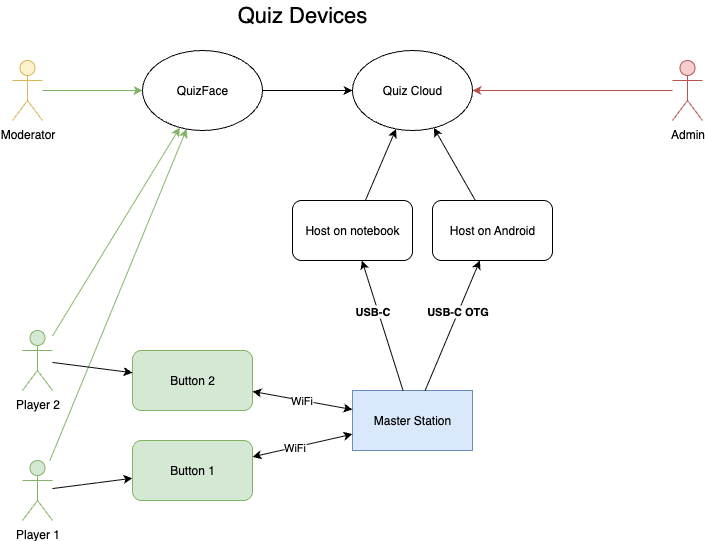
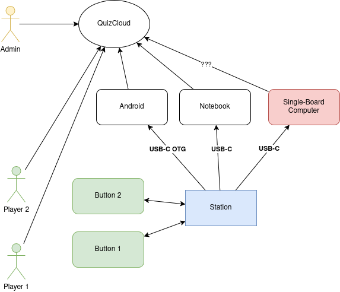

# General info

General information and tech design

## Overview

The QuizClash application is a quiz game that allows players to create and play quizzes with a moderator.
A few players form a team (as TeamMember), and they have to answer questions after a start is announced by the moderator.
The captain of the team indicates the readiness to answer. The moderator can see the sequence 
in which captains indicated their readiness and choose the one to answer.
The chosen team gives an answer to the question.
Moderator takes the answer and decides if it was right or wrong.

Roles:
- moderator: the person who creates and manages the quizzes and teams
- teams: the players who play the quizzes
- captain: the person who indicates an answer
- team member: the users who play the quizzes and help the captain answer the questions

### Roles

Moderator:
- creates and manages the quizzes
- creates and manages the questions
- creates the teams
- designates captains for each team
- announces the questions and the start of each question
- decides who will answer the question
- decides if the answer was right or wrong
- takes the results of the questions and displays them

Team:
- communicate as a team to answer questions

Captain:
- indicates the readiness to answer a question

Team Member:
- answer questions
- observe the results of when other teams indicated their readiness

### Indicators

Captain may use either a physical button or a smartphone Telegram app to indicate their readiness.

### Hardware devices

The captain can react by pressing a provided button device. 
The device will send a signal over ESP-NOW protocol to
the master station. The master station will send the signal via the companion to the cloud.
Moderator can see the time when each captain indicated the readiness (or no answer within the timeout).

## Technologies for the devices

- ESP8266 for button devices
- ESP32 for master station
- ESP-NOW protocol between devices
- Companion app proxy
- Serial (USB-to-UART) between the master station and the host computer connected to the internet
- HTTP between the host computer and the Quiz cloud

## Protocols

- ESP-NOW protocol between devices
- Either [Bluetooth](tech-spec/Companion-app-proxy.md) or [Serial (USB-to-UART)](tech-spec/Serial-protocol.md)
- [HTTP between the host computer or companion and the Quiz cloud](/tech-spec/Remote-protocol.md)

## Overview Devices

## Cloud Architecture

