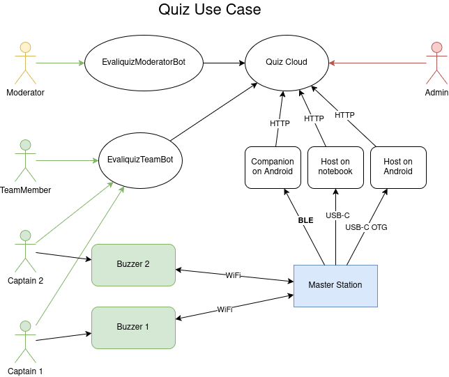

# Evaliquiz

Evaliquiz - General information and tech design

## Overview

The Evaliquiz application is a quiz game that allows players to create and play quizzes with a moderator.
A few players form a team (as TeamMember), and they have to answer questions after a start is announced by the moderator.
The teams choose a captain who will be buzzing in to indicate their readiness to answer.
The moderator can see the sequence in which captains buzzed in and choose the one to answer.
The chosen team gives an answer to the question.
Moderator takes the answer and decides if it was right or wrong.

Roles:
- admin: manages the system, does not play the games
- moderator: the person who creates and manages the quizzes and teams
- teams: the players who play the quizzes
- captain: the person who is buzzing in (sends an attempt)
- team member: the users who play the quizzes and help the captain answer the questions

The game is described in the [Game](Game.md) section.

### Roles

Admin:
- maintains the system
- the UI for admin may be implemented as JHipster administrator UI
- cannot be either a moderator or a team member

Moderator is driving the whole game:
- creates and manages the quizzes and questions
- creates the teams
- designates captains for each team
- announces the questions and the start of each question
- decides who will answer the question
- decides if the attempt to answer was right or wrong
- takes the results of the questions and displays them

Team:
- has fun playing the game

Captain:
- buzzes in

Team Member:
- it is anonymous, and it is not connected to its Telegram ID
- answer questions
- observe the results of buzzing in

### Buzzing in

Captains may use either a physical button (buzzer) or a smartphone Telegram mini-app to indicate their readiness.

### Hardware devices

Buzzers and master station are optional for the game. When used, it must be connected and
configured before the game starts.
[Hardware devices](buzzer-spec/Devices.md) make the game more attractive.

## Real-time Updates

During gameplay, moderator and team mini-apps need live updates for round state changes, buzzer events, and moderator judgments.

**Approach: Server-Sent Events (SSE)**

The backbone exposes SSE endpoints that push game events to connected clients. SSE is chosen over WebSocket because updates are primarily server→client (unidirectional), and SSE is simpler to implement with Spring MVC (the backbone is a non-reactive JHipster monolith).

Client→server actions (state transitions, attempt creation) use regular REST calls.

**SSE event types:**
- `round-status` — round state transitions (IDLE → READY → STARTED → ANSWERED → FINISHED)
- `attempt` — new attempt created (captain buzzed in)
- `attempt-update` — moderator set `chosen` or `correct` on an attempt
- `game-status` — game state transitions (CREATED → IN_PROGRESS → FINISHED)

**SSE endpoints:**
- `GET /api/games/{id}/events` — moderator subscribes to all events for their game (requires Moderator JWT)
- `GET /api/games/{id}/team-events` — team members subscribe to game events (requires EvaliquizTeamBot JWT; question hints are excluded)

## Telegram Bots

### EvaliquizModeratorBot

The moderator interacts with backbone exclusively through a Telegram mini-app launched from EvaliquizModeratorBot.

**Registration flow:**
1. User opens EvaliquizModeratorBot in Telegram
2. Bot sends `/start` → backbone creates a `User` entity and `ModeratorProfile` linked to the Telegram ID
3. Backbone issues a JWT for the moderator
4. Mini-app uses this JWT for all backbone REST calls

**Mini-app views:**
- **Quizzes**: CRUD for quizzes and questions
- **Games**: create game, assign quiz, select companion, manage teams
- **Game lobby**: add teams, add team members, designate captains, start game
- **Live game**: round management (create round, transition states), view attempts, choose captain to answer, judge answers
- **Game results**: view finished game's rounds and attempts

### EvaliquizTeamBot

The team bot provides game access to team members without backbone authentication. Team members are anonymous — the bot mediates all backbone access.

**Joining flow:**
1. Moderator shares a deep link: `https://t.me/EvaliquizTeamBot?start=game_<gameId>_team_<teamId>`
2. Team member opens the link → bot registers them as a `TeamMember` (anonymous, `captain=false`)
3. Bot returns a mini-app link for the team view

**Captain designation:**
The moderator designates the captain through EvaliquizModeratorBot by setting `TeamMember.captain = true`. Only one captain per team is allowed (enforced by the service layer).

**Game state visibility:**
Team members can see through the mini-app:
- Current round status
- Whether their team has buzzed in
- Attempt results (chosen, correct) after moderator judgment
- Team members **cannot** see question hints

**Mini-app buzzing (non-hardware path):**
1. Captain sees a buzzer button in the mini-app (active only when round is STARTED)
2. Captain taps the button → mini-app sends request to EvaliquizTeamBot backend
3. EvaliquizTeamBot sends `POST /api/attempts` to backbone with its service JWT
4. Backbone sets `Attempt.receivedAt` to server time; `Attempt.reaction` is null

### Team and captain management during game

- The captain cannot be changed while the game is IN_PROGRESS
- Team members can be added during an IN_PROGRESS game (late joiners)
- Team members cannot be removed during an IN_PROGRESS game
- Teams cannot be added or removed during an IN_PROGRESS game

## System Topology

